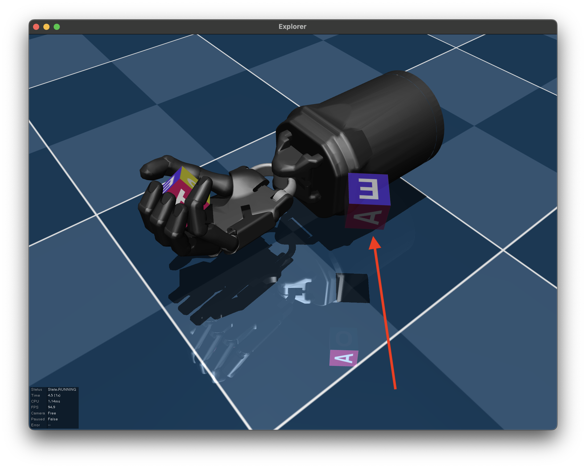

# MuJoCo Weekly: Tips and Tricks for MuJoCo Users, Every Week

A weekly "newsletter" introducing [MuJoCo](https://github.com/deepmind/mujoco) users to new features, tips, and tricks.

- [MuJoCo Weekly: Tips and Tricks for MuJoCo Users, Every Week](#mujoco-weekly-tips-and-tricks-for-mujoco-users-every-week)
  - [Week 1: Gravity Compensation](#week-1-gravity-compensation)
  - [Week 2: Ghostifying an Object](#week-2-ghostifying-an-object)

## Week 1: Gravity Compensation

Here are two ways to implement gravity compensation in MuJoCo:

- Inject fake upwards forces at the center-of-mass (CoM) of each body in a kinematic chain such that each force exactly counteracts the body’s weight (weight = gravity x mass). Write these forces to `xfrc_applied` which are user-defined Cartesian wrenches that MuJoCo will apply to body CoMs.

```python
def compensate_gravity(self, model: mjcf.RootElement, physics: mjcf.Physics) -> None:
    gravity = np.hstack([physics.model.opt.gravity, [0, 0, 0]])
    physics_bodies = physics.bind(model.find_all("body"))
    physics_bodies.xfrc_applied[:] = -gravity * physics_bodies.mass[..., None]
```

- Use the body’s `gravcomp` attribute, which is a new feature added as of version 2.3.1. `gravcomp=1.0` will exactly counteract gravity, values greater than 1 will create a buoyancy effect. The default value for gravcomp is 0.

```python
def compensate_gravity(model: mjcf.RootElement) -> None:
    for body in model.find_all("body"):
        body.gravcomp = 1.0
```

## Week 2: Ghostifying an Object

<p float="left">
  
</p>

To disable contacts with a body in a scene, iterate through all its geoms and set their contype and conaffinity to 0.

```python
for geom in prop.find_all("geom"):
    geom.contype = 0
    geom.conaffinity = 0
```

There are many use cases for disabling contacts (one being speeding up the physics pipeline), but let's talk about one particular useful instance: "ghostifying" an object for use as a visual hint. For example, in manipulation, you might want to [visually render an object's goal pose](https://youtu.be/Bdx7DuAMB6o?t=135). The MuJoCo way to achieve this is to:

1. Duplicate the object of interest
2. Iterate through all its geoms and set their contype and conaffinity to 0
3. Iterate through all its bodies and set their mocap attribute to True
4. Optional: make each geom transparent

Note that `mocap=True` effectively disables the object's dynamics (it is treated as fixed by the simulator).
